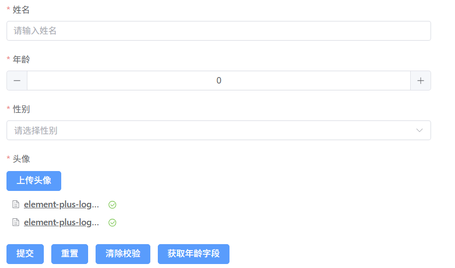
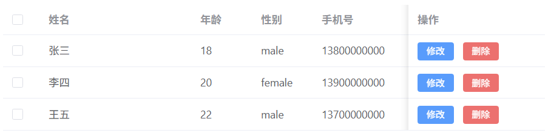

# Element Plus Dynamic Form

基于 Element Plus 的动态表单/动态表格，支持通过配置快速生成表单/表格。

### [查看文档](https://cj814.github.io/element-plus-dynamic-form-docs/)

## 安装

```bash
npm install element-plus-dynamic-form
```

## 快速开始

### 1. 安装依赖

```bash
npm install element-plus-dynamic-form element-plus
```

### 2. 引入样式

```typescript
// 在你的 main.ts 或入口文件中引入 Element Plus 样式
import ElementPlus from 'element-plus'
import 'element-plus/dist/index.css'
import { FormRender, BaseTable } from 'element-plus-dynamic-form'

const app = createApp(App)
app.use(ElementPlus)
app.component('FormRender', FormRender)
app.component('BaseTable', BaseTable)

app.mount('#app')
```

### 3. 使用组件

#### 动态表单【FormRender】

```html
<template>
  <form-render :form-items="formItems" :form-data="formData" ref="formRenderRef" />
  <div>
    <el-button type="primary" @click="handleSubmit">提交</el-button>
    <el-button type="primary" @click="handleClearAgeValidate">清空年龄字段校验</el-button>
  </div>
</template>

<script setup lang="tsx">
  import { computed, ref } from 'vue'
  import { ElForm, ElMessage } from 'element-plus'

  const ageLabel = ref('年龄')
  const ageRequired = ref(true)
  const formRenderRef = ref<InstanceType<typeof ElForm>>()
  const formItems = computed(() => [
    {
      renderType: 'el-input',
      itemProps: {
        prop: 'name',
        label: '姓名',
        rules: [
          {
            required: true,
            message: '请输入姓名',
            trigger: ['blur']
          }
        ]
      },
      comProps: {
        placeholder: '请输入姓名'
      },
      comEvents: {
        onBlur: () => {
          if (!formData.value.name) {
            ElMessage.error('请输入姓名')
          }
        }
      }
    },
    {
      renderType: 'el-input-number',
      itemProps: {
        prop: 'age',
        label: ageLabel.value,
        rules: [
          {
            required: ageRequired.value,
            message: '请输入年龄',
            trigger: ['blur', 'change']
          }
        ]
      },
      comProps: {
        placeholder: '请输入年龄',
        style: {
          width: '100%'
        }
      }
    }
  ])

  const formData = ref({
    name: '',
    age: 0
  })

  const handleSubmit = () => {
    formRenderRef.value?.validate((valid) => {
      if (valid) {
        ElMessage.success('提交成功')
      } else {
        ElMessage.error('提交失败')
      }
    })
  }

  const handleClearAgeValidate = () => {
    const ageFieldRef = formRenderRef.value?.getField('age')
    ageFieldRef?.clearValidate()
  }
</script>
```

#### 动态表格【BaseTable】

```html
<template>
  <base-table :table-columns="tableColumns" :table-data="tableData" />
</template>

<script setup lang="tsx">
  import { ref, computed } from 'vue'
  const tableColumns = computed(() => [
    {
      prop: 'name',
      label: '姓名'
    },
    {
      prop: 'age',
      label: '年龄'
    }
  ])
  const tableData = ref([
    {
      name: '张三',
      age: 18
    },
    {
      name: '李四',
      age: 20
    },
    {
      name: '王五',
      age: 22
    }
  ])
</script>
```

### 4. 预览

#### 动态表单【FormRender】



#### 动态表格【BaseTable】


